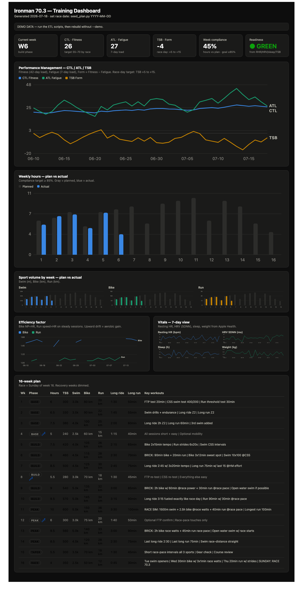
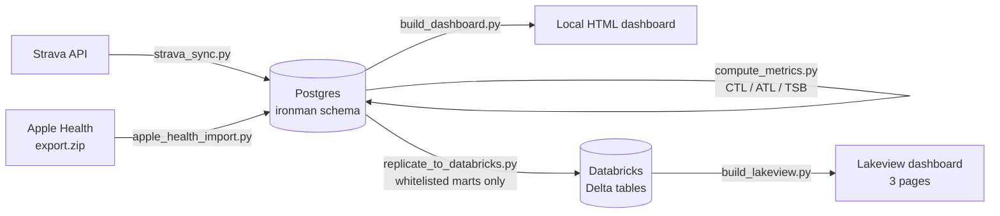
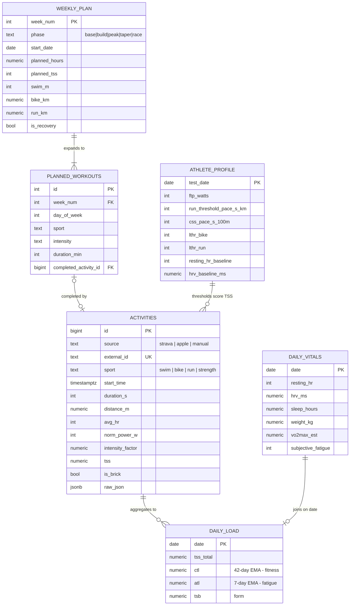

# 🏊🚴🏃 Journey to Ironman 70.3 — a data-driven training system

**Turn your Strava history and Apple Watch into a full training intelligence
stack: Postgres warehouse, sports-science KPIs, a 16-week periodized plan, and
dashboards that tell you every week whether you're on track — locally and on
Databricks.**

1.9 miles of swimming. 56 miles on the bike. 13.1 miles of running.
A 70.3 doesn't reward heroics — it rewards *consistency you can measure*.
This repo is the measurement system.


*Local dashboard (demo data): performance management, plan-vs-actual
compliance, sport volumes, efficiency trends, vitals, and the full 16-week plan.*

## What you get

- **A real training database** — every workout from Strava, every vital from
  Apple Health, deduplicated, TSS-scored, and queryable in Postgres.
- **A 16-week periodized 70.3 plan** — base → build → peak → taper, 138
  day-level sessions, recovery weeks, brick workouts, race simulation — seeded
  as data, so plan-vs-actual is just a SQL join.
- **The sports-science KPI layer** — CTL/ATL/TSB (performance management),
  efficiency factor, acute:chronic workload ratio, readiness flags — the same
  models coaches use, computed transparently.
- **Two dashboards** — a zero-dependency local HTML dashboard (single file,
  works offline), and a Databricks Lakeview dashboard with deeper cuts:
  training-time heatmaps, yearly volumes, best-effort progressions.
- **Your data stays yours** — everything runs locally; the cloud layer is
  optional and receives only whitelisted, personal-data-free marts.

## Architecture



## Data model



Views on top (the KPI layer): `v_weekly_actuals`, `v_weekly_compliance`,
`v_efficiency`, `v_readiness`, plus analytics marts (`v_monthly_volume`,
`v_yearly_summary`, `v_dow_hour`, `v_best_efforts`, `v_records`,
`v_run_load_ratio`, `v_run_distance_dist`) in [analytics_views.sql](analytics_views.sql).

## The metrics, defined

| Metric | Formula | What it tells you |
|---|---|---|
| **TSS** (Training Stress Score) | `hours × IF² × 100` (bike power, run pace, swim pace, HR fallback) | How hard a single workout was, normalized across sports |
| **IF** (Intensity Factor) | workout intensity ÷ your threshold (FTP / threshold pace / CSS) | 0.70 = easy endurance, 0.85 = 70.3 race effort, 1.0 = one-hour max |
| **CTL** (Chronic Training Load) | 42-day exponential average of daily TSS | *Fitness.* Builds slowly, the number you're growing for 16 weeks |
| **ATL** (Acute Training Load) | 7-day exponential average of daily TSS | *Fatigue.* Spikes fast, fades fast |
| **TSB** (Training Stress Balance) | yesterday's CTL − ATL | *Form.* Negative = building, deeply negative = overreaching, +5..+15 = race-ready |
| **EF** (Efficiency Factor) | bike: NP ÷ HR · run: speed ÷ HR (steady sessions) | Aerobic engine. Rising EF at the same HR = you got fitter |
| **ACWR** (Acute:Chronic Workload Ratio) | 7-day run km ÷ 28-day weekly average | Injury guard. Safe band 0.8–1.3; >1.5 = ramp too fast |
| **FTP / CSS / Threshold pace** | 4-weekly field tests | The anchors every zone and every TSS is computed from |
| **Readiness** | rules over resting HR, HRV, sleep, TSB | green / yellow / red — whether to train hard *today* |

### Weekly on-track / off-track rules

| KPI | On track | Off track |
|---|---|---|
| Hours & TSS compliance | ≥ 85% of plan | < 70% two weeks running, or > 120% (doing too much) |
| CTL ramp | +3–6 per week | flat 2+ weeks, or > +8/week (injury risk) |
| TSB in build | −10 to −25 | < −30 → forced recovery |
| Per-sport volume | each ≥ 80% of plan | any sport < 60% — the weakness compounds |
| Long ride & long run | done every non-recovery week | 2 misses in a row |
| Resting HR / HRV | within ±3 bpm / ±15% of baseline | +7 bpm or −15% → red flag, back off |

## The 16-week plan

| Weeks | Phase | Hours/wk | Focus |
|---|---|---|---|
| 1–4 | Base | 6–7.5 | All aerobic Z2, baseline tests (FTP · CSS · run threshold), W4 recovery |
| 5–8 | Build 1 | 7.5–8.5 | Tempo & sweet spot, first brick, W8 recovery + re-test |
| 9–12 | Build 2 | 9–10 | Race-pace bricks, open water, nutrition rehearsal, W12 recovery |
| 11 | — | peak | **Race simulation**: 1500m swim + 2.5h bike @ race watts + 40min run |
| 13–14 | Peak | 8.5–9.5 | Final race-specific block |
| 15 | Taper | 5.5 | Volume −40%, keep intensity touches, sleep |
| 16 | **Race** | — | Openers Tue–Thu, then 70.3 on Sunday |

Standard week: Mon strength · Tue swim + run · Wed bike quality · Thu swim +
strength · Fri run quality · Sat long ride (brick weeks 6/9/11/13) · Sun long run.

## Quickstart

### 1. Local (Postgres + HTML dashboard)

```bash
git clone <this repo> && cd ironman-703
python3 -m venv .venv && .venv/bin/pip install "psycopg[binary]" requests

cp .env.example ~/.ironman.env       # fill in IRONMAN_DB_URL + Strava app creds
source ~/.ironman.env

psql "$IRONMAN_DB_URL" -f schema_pg.sql          # tables + KPI views
psql "$IRONMAN_DB_URL" -f analytics_views.sql    # analytics marts
.venv/bin/python seed_plan.py 2026-11-08         # your race date (a Sunday)

.venv/bin/python etl/strava_auth.py              # one-time browser OAuth
.venv/bin/python etl/strava_sync.py --days 3650  # full history
.venv/bin/python etl/apple_health_import.py ~/Downloads/export.zip  # optional vitals
.venv/bin/python etl/compute_metrics.py          # CTL/ATL/TSB
.venv/bin/python dashboard/build_dashboard.py    # -> dashboard/dashboard.html
```

Enter your thresholds after week-1 tests (drives accurate TSS):

```sql
INSERT INTO ironman.athlete_profile
  (test_date, weight_kg, ftp_watts, run_threshold_pace_s_km, css_pace_s_100m,
   lthr_bike, lthr_run, max_hr, resting_hr_baseline, hrv_baseline_ms)
VALUES ('2026-07-20', 78, 220, 330, 130, 155, 165, 185, 52, 48);
```

### 2. Databricks (optional cloud analytics)

```bash
databricks auth login --host https://<your-workspace>.cloud.databricks.com
export DATABRICKS_WAREHOUSE_ID=<sql-warehouse-id>

.venv/bin/python etl/replicate_to_databricks.py  # marts -> Delta tables
.venv/bin/python dashboard/build_lakeview.py     # 3-page Lakeview dashboard
```

Lakeview pages: **Overview** (PMC, compliance, records) · **Activities**
(monthly volumes, day×hour training heatmap, yearly distances) · **Runner
Profile** (best efforts 5k→marathon, pace progression by year, ACWR injury guard).

## Automation

`etl/daily_sync.sh` runs the whole pipeline (Strava → metrics → dashboard →
Databricks) and is safe to re-run any time: every load is an upsert keyed on
`(source, external_id)`, so duplicates are impossible. Schedule on macOS with
a launchd LaunchAgent (daily 06:30; a missed run fires at next wake):

```xml
<!-- ~/Library/LaunchAgents/com.tripeak.dailysync.plist -->
<key>ProgramArguments</key>
<array><string>/bin/zsh</string><string>/path/to/ironman-703/etl/daily_sync.sh</string></array>
<key>StartCalendarInterval</key>
<dict><key>Hour</key><integer>6</integer><key>Minute</key><integer>30</integer></dict>
```

To run even if the machine is asleep, add a scheduled wake just before:
`sudo pmset repeat wakeorpoweron MTWRFSU 06:28:00`.

## Privacy by design

- **No credentials in this repo.** Everything sensitive lives in environment
  variables (`.env.example` documents them); tokens created by `strava_auth.py`
  are written to `~/.ironman.env` with mode 600.
- **Your training data never gets committed.** `dashboard/dashboard.html`
  (rendered from your data), CSV exports, and Apple Health archives are
  gitignored. Screenshots in this README use generated demo data.
- **Cloud replication is whitelist-only.** `replicate_to_databricks.py` exports
  an explicit list of `ironman.*` marts — never a full database dump — and
  prints an audit list of every file uploaded, every run.

## Repo map

```
schema_pg.sql               core schema: tables + KPI views (Postgres)
analytics_views.sql         analytics marts (volumes, best efforts, ACWR, records)
seed_plan.py                16-week plan -> weekly_plan + planned_workouts
db.py                       connection helper (IRONMAN_DB_URL)
etl/strava_auth.py          one-time Strava OAuth (activity:read_all)
etl/strava_sync.py          Strava -> activities, TSS/IF scoring, idempotent
etl/apple_health_import.py  export.zip -> daily_vitals + backup workouts
etl/compute_metrics.py      CTL / ATL / TSB daily rebuild
etl/replicate_to_databricks.py  whitelisted marts -> Delta tables
dashboard/build_dashboard.py    self-contained local HTML dashboard
dashboard/build_lakeview.py     Databricks Lakeview dashboard (3 pages)
```

## License

MIT — train hard, race smart.
